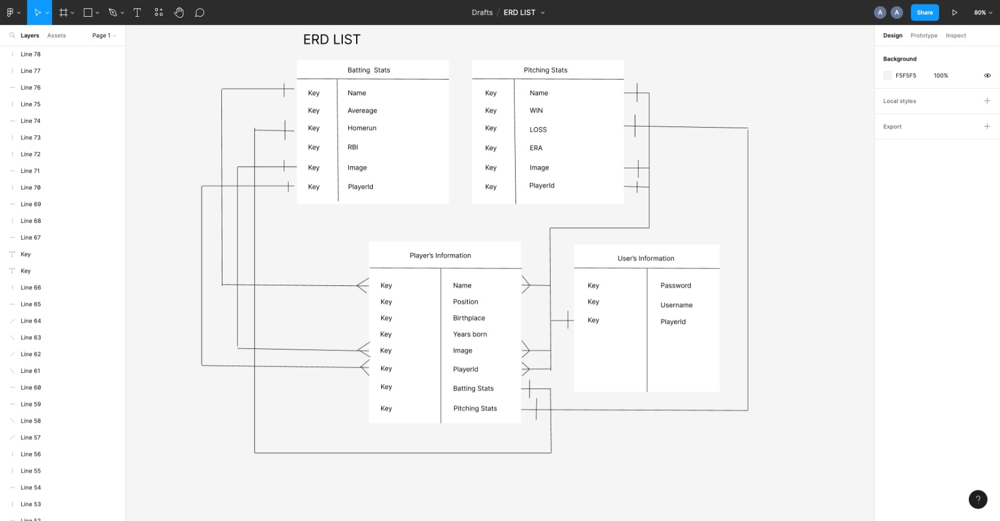

# ** TITLE **  Baseball Stats Data Collection

# Wireframe

--

--

--

---

User Stories

 MVP
  1. As a user, I want a user to make the stats of baseball player, a pitcher and a batter on the stats creator form.
  2. As a user, I want to see all the data of the baseball player name and the stats on the baseball data collection screen. 
  3. I want to have a user to delete and update by pushing delete or update button.

  Version 2
  1. AS a user, I want to upload he image of player in addition to the name and stats.
  2. As a user, I want to make a player's birth place and year he was born as a subdocument.

